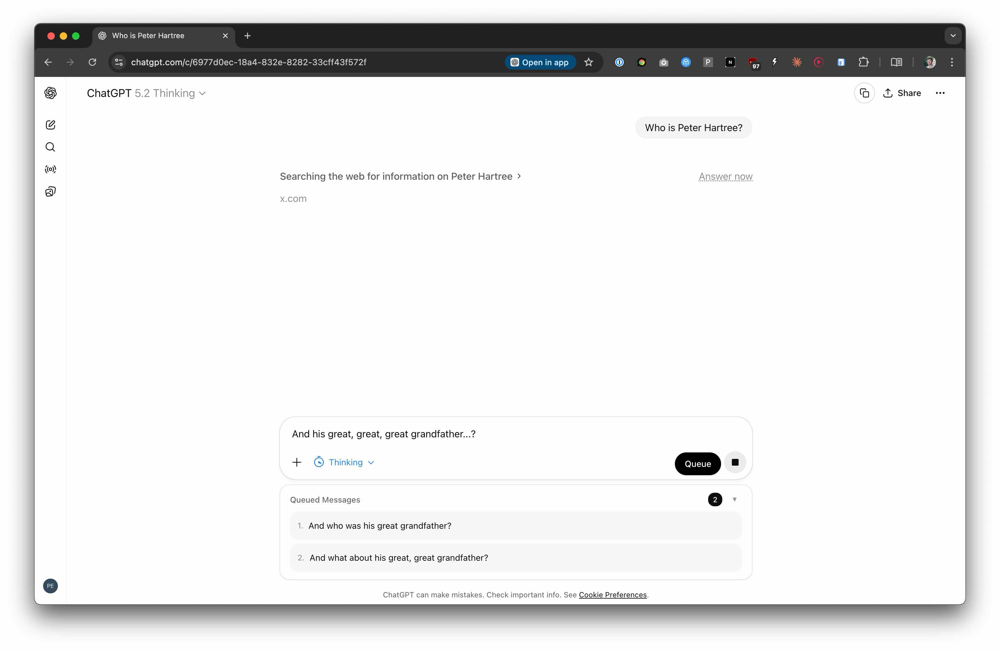

# ChatGPT Message Queue

A Chrome extension that lets you queue follow-up messages while ChatGPT is generating a response.

## What it does

When ChatGPT is busy generating a response, you can't normally send another message. This extension solves that by:

- **Intercepting messages** sent while ChatGPT is generating
- **Queueing them locally** with per-conversation storage
- **Automatically sending** queued messages once the response completes

## How to install

1. Clone this repository or [download the zip file](https://github.com/HartreeWorks/chatgpt-queue/archive/refs/heads/main.zip)
2. Open Chrome and go to `chrome://extensions/`
3. Enable **Developer mode** (toggle in top right)
4. Click **Load unpacked**
5. Select the folder containing this extension

## Usage

1. Start a conversation on [chatgpt.com](https://chatgpt.com)
2. While ChatGPT is generating a response, type your follow-up message
3. Either:
   - Press Enter / click Send to queue the message, or
   - Click the **Queue** button that appears next to the stop button
4. Your message will be sent automatically when the response completes

## Files

- `manifest.json` - Extension configuration
- `content.js` - Main logic (detection, interception, queue management)
- `styles.css` - Native-feeling UI styles
- `popup.html/js` - Popup for managing the queue
- `background.js` - Badge updates

## License

MIT
